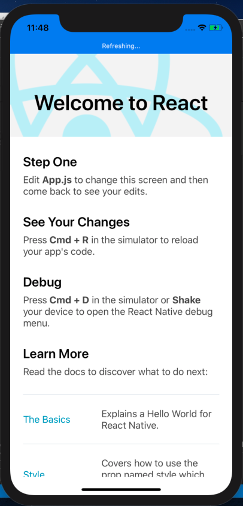

# COVID-19 Application and Homework


#### Step 1:  Setup your REACT Native Environment [Done]          
```
brew install node
brew install watchman

```


Install XCode command line tools and cocoapods

```
sudo gem install cocoapods
```
     

#### Step 2: Build and run Hello App on emulator and phone [Done]      
- Follow this link: https://reactnative.dev/docs/getting-started    
- Detailed code in this project can be viewed in folder **1. AwesomeProject**   
- See hello world app below:
    


